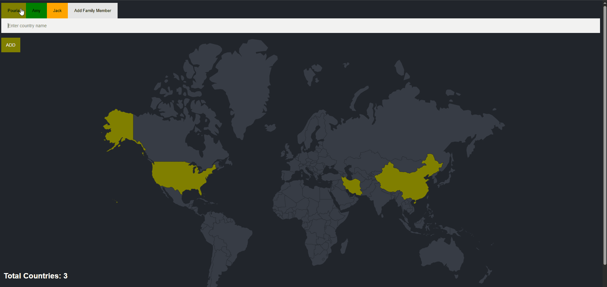

# 🌍 Family Travel Tracker

An interactive web application that lets users track and visualize the countries they’ve visited on a world map.  
Built with **Node.js**, **Express**, **EJS**, and **PostgreSQL**, it allows multiple users (e.g., family members) to track their visited countries individually. Each user has a personal color, and switching between user tabs updates the map to show their specific visited countries.”

---

## ✨ Features

- 👥 Multiple users with personalized profiles  
- 🗺️ Interactive world map highlighting each user's visited countries in their chosen color  
- 🎨 Each user selects a custom color when created  
- ➕ Add new countries for the active user via input form  
- 🔄 Easily switch between users to view their maps  
- ⚠️ Smart error handling for invalid or duplicate country entries  
- 💾 Data persistence with PostgreSQL  


---

## 📸 Demo

  


---

## 🗄️ Database Setup (Using pgAdmin / PostgreSQL)

Follow these steps to set up the PostgreSQL database for **Travel Tracker**.

---

### 🧩 Step 1: Create a New Database
1. Open **pgAdmin** and connect to your PostgreSQL server.  
2. Right-click on **Databases** → click **Create** → **Database**.  
3. Enter the name: `travelTracker`.  
4. Click **Save**.

---

### 🧱 Step 2: Create the Required Tables

1. Right-click on your new database → choose **Query Tool**.  
2. Paste and run this SQL command:

```sql
CREATE TABLE users (
    id SERIAL PRIMARY KEY,
    name VARCHAR(15) UNIQUE NOT NULL,
    color VARCHAR(15)
);

CREATE TABLE visited_countries (
    id SERIAL,
    country_code CHAR(2) NOT NULL,
    user_id INTEGER REFERENCES users(id),
    PRIMARY KEY (country_code, user_id)
);

INSERT INTO users (name, color)
VALUES ('World Map', 'teal');

-- Optional Join --

SELECT *
FROM visited_countries
JOIN users
ON users.id = user_id;
```
3. Click Execute (▶️) to create the tables.

---


### 📥 Step 3: Import the `countries.csv` File

1. In **pgAdmin**, expand your database → right-click on the **countries** table → choose **Import/Export Data**.  
2. Under **Filename**, browse and select the `countries.csv` file from your project folder.  
3. Set **Format** to `CSV`.  
4. Check ✅ **Header** (to include the first line of the CSV as column names).  
5. Leave **Delimiter** as a comma `,`.  
6. Click **OK** to import the data.

> 💡 **Tip:**  
> - The `countries.csv` file must contain columns named `id`, `country_code`, and `country_name`.  
> - The `id` column should be defined as `SERIAL PRIMARY KEY` so PostgreSQL will automatically continue numbering for any new rows inserted later.

---

## 🔑 Database Authentication

The app connects to PostgreSQL using your own username, password, and database name.  
Open `index.js` and replace the placeholder values with your actual credentials:

```js
const db = new pg.Client({
  user: "your-username-here",      // ← Your PostgreSQL username
  host: "localhost",               // ← Usually localhost
  database: "travelTracker",       // ← Your database name
  password: "your-password-here",  // ← Your PostgreSQL password
  port: 5432,                      // ← Default PostgreSQL port
});
```

---
## ⚠️ Error Handling

The **Travel Tracker** app includes smart error handling to ensure a smooth user experience:

- 🏷️ **Invalid or Blank Input:**  
  If a user submits an empty field or a country name that doesn’t exist in the database, an error message appears saying:  
  **“Country does not exist, try again.”**

- 🔁 **Duplicate Country Entry:**  
  If a user tries to add a country that’s already been added to his profile before, an error message appears saying:  
  **“Country has already been added, try again.”**

- 🔡 **Case and Name Flexibility:**  
  The app handles capitalization and partial name inputs intelligently — for example:  
  - Typing “iran” instead of “Islamic Republic of Iran” 
  - Typing “america” instead of “United States of America”  
  All of these still work correctly because the app uses the **`LIKE`** SQL operator and **`toLowerCase()`** logic to match names flexibly.

---
## ⚙️ How to Run

1. **Clone the repository**
   ```bash
   git clone https://github.com/your-username/travel-tracker.git
   cd travel-tracker
   ```
2. **Install dependencies**
   ```bash
   npm install

   ```
3. **Start the server**
   ```bash
   node index.js
   ```
4. **Open the app**
   Visit 👉 http://localhost:3000
   in your browser.
> 💡 **Tip:**  
> To use a different port, open `index.js` and change  
> `const port = 3000;` to your preferred port number.

---

## 🛠️ Built With

### Core Tech
- [Node.js](https://nodejs.org/)  
- [Express.js](https://expressjs.com/)  
- [EJS](https://ejs.co/)  
- HTML5 / CSS3  

### Additional Libraries
- [pg](https://www.npmjs.com/package/pg) – PostgreSQL client for Node.js  
- [body-parser](https://www.npmjs.com/package/body-parser) – to parse form submissions


